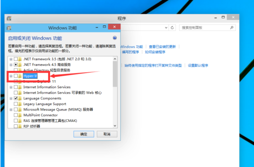
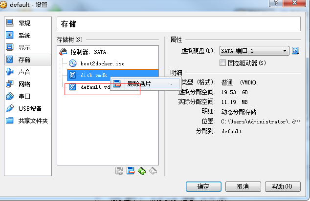

### 1. Window10 下安装

> Window10 下载最新的 [Docker for windows](https://store.docker.com/editions/community/docker-ce-desktop-windows) 安装包进行安装

Windows10 下可以切换 Docker Platform 为 Linux 或者 Window，下载的镜像需要对应的平台支持。

Window10 下自带了虚拟器，需要开启 Hyper-V，在 控制面板-程序-打开Windows功能 中开启


>Windows10 下的 Docker 使用虚拟机 IP 即为本机 127.0.0.1 ，可以在 CMD、PowerShell 中直接进行操作。

### 2. Windows7 下安装

> Windows7 下在最新的 [DockerToolBox](https://docs.docker.com/toolbox/toolbox_install_windows/) 安装包进行安装
DockerToolBox 会自动安装 Oracle Virtual Box 虚拟机，需要依托虚拟机进行启动。  

#### 2.1 创建 docker machine

> 安装完成后会附带 docker-machine.exe 使用此工具可以安装 docker 环境

1. 查询 docker machine

```bash
docker-machine ls
```

2. 创建 default machine

> 使用 virtualbox 驱动模式，会自动下载 docker2boot.iso 镜像进行创建 virtualbox 虚拟机

```bash
docker-machine create -d virtalbox default
```

3. 查看 docker 信息

```bash
docker-machine env default
```

4. 管理 docker machine

```bash
docker-machine -h
```


#### 2.2 使用 putty

> 在 Windows 命令进入 Docker 后，shell 不能复制，操作不方便，因此使用支持 SSH 的工具来连接 docker 虚拟机。

1. 查询 docker mechine ip：
> 在 docker machine env 中的 DOCKER_HOST 

```bash
docker-machine env default
```


2. 使用 Putty 连接到 docker 终端：

> 默认用户名：docker 密码： tcuser


> PS：在 DockerToolBox 下自动安装的是 VirtualBox5.1，但是在启动 docker default mechine 时一直出错（VERR_SUPDRV_HARDENIGN_EVIL_HANDLE），经过查询是由于该版本的 vboxdrv 核心驱动请求过大的访问权限。。
最后安装旧版的 VirtualBox4.3.12 后成功解决。


#### 2.3 docker virtualbox 管理

由于使用 docker-machine 创建的虚拟机默认路径为 **/user/.docker/machine/** 下，可能在以后容器创建过多时占用系统盘资源。将 virtualbox 虚拟硬盘移动到其它盘。
1. 复制 default vmdk 到指定路径
> 在指定盘进行复制一份 vmdk 


2. 为 default 虚拟机添加新的虚拟硬盘
>添加新的虚拟硬盘后，删除原来的 disk.vmdk 文件即可



修改完成后，重启 docker machine 即可

参考资料：  
[1] 白皮书：https://www.gitbook.com/book/yeasy/docker_practice/details
[2] 官方：https://www.docker.com/
[3] 镜像库：https://hub.docker.com/